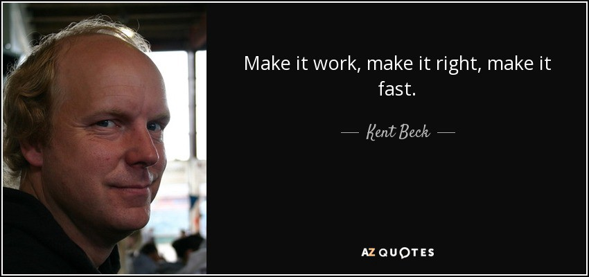

import { StaticImage } from "gatsby-plugin-image";
import { ProjectStatus } from "../../src/components/projects/ProjectStatus";

The inspiration behind Allchat was to bring the experience of Twitch chat to all live events. The fast paced, energetic, and absolutely ridiculous nature of Twitch chat is often the most entertaining part of watching a stream. The shared interest in the subject of the stream is all that is required to form a unique community that people are excited to participate in. 

Allchat's goal was to allow these communities to form around any shared interest, not just a streamer. Channels would be created for live events such as:
- TV premiers
- Concerts
- Sporting events

Channels would also have the option of being location locked or unlocked, so that only people attending a live event could pariticipate.

With these goals in mind we spent a long time trying to plan out an infrastructure that could support many simultaneous users from around the world. The below diagram shows the architechture, which consisted of local loadbalancing to websocket servers to send/receive messages and then another api layer behind those servers that exchanged messages between them and pulled data from backend databases. Additionally, a Redis cluster would store information on which users/channels were connected to a given api node in order to distribute messages efficiently across the cluster.

In addition to a resilient backend, a user friendly client would be key to this project. Since I already was familiar with React and to make a cross-platform solution the client was built with React Native. 

After working on the project for several months, my teammate and I had the infrastructure setup and a working mobile client, but we really had just run out of steam spending so much time planning ahead instead of focusing on getting an MVP out the door. This is when I came to appreciate one of the main axioms of programming that I follow today:

