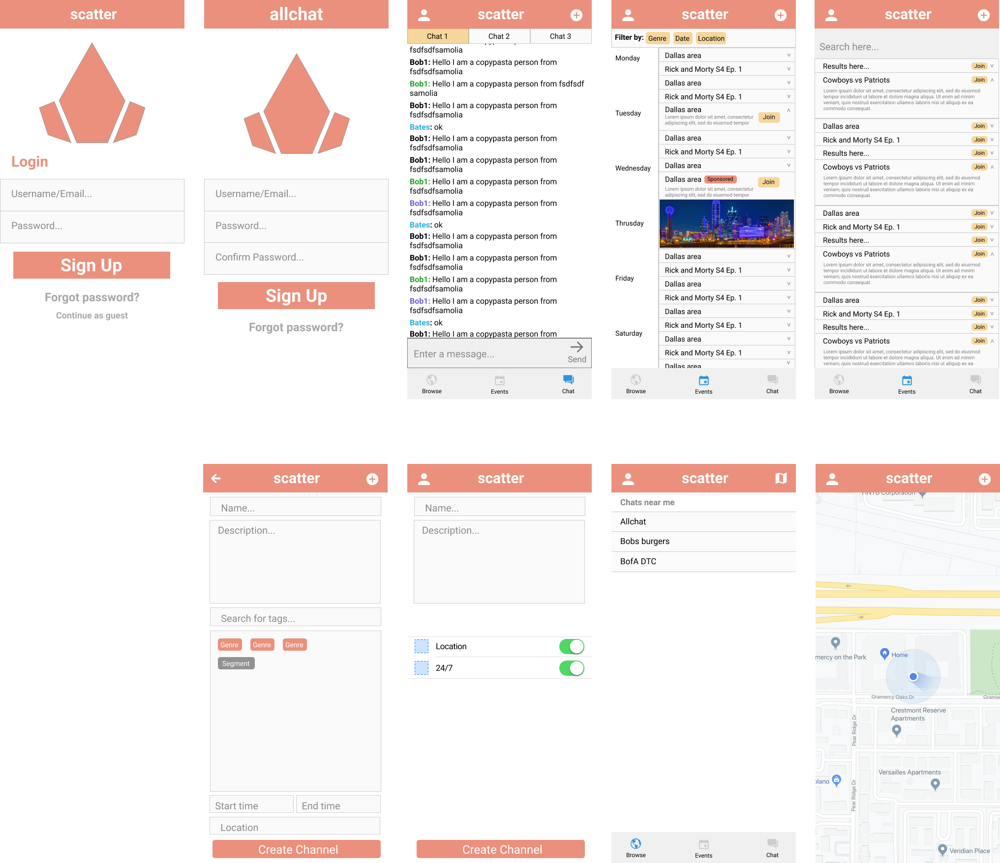
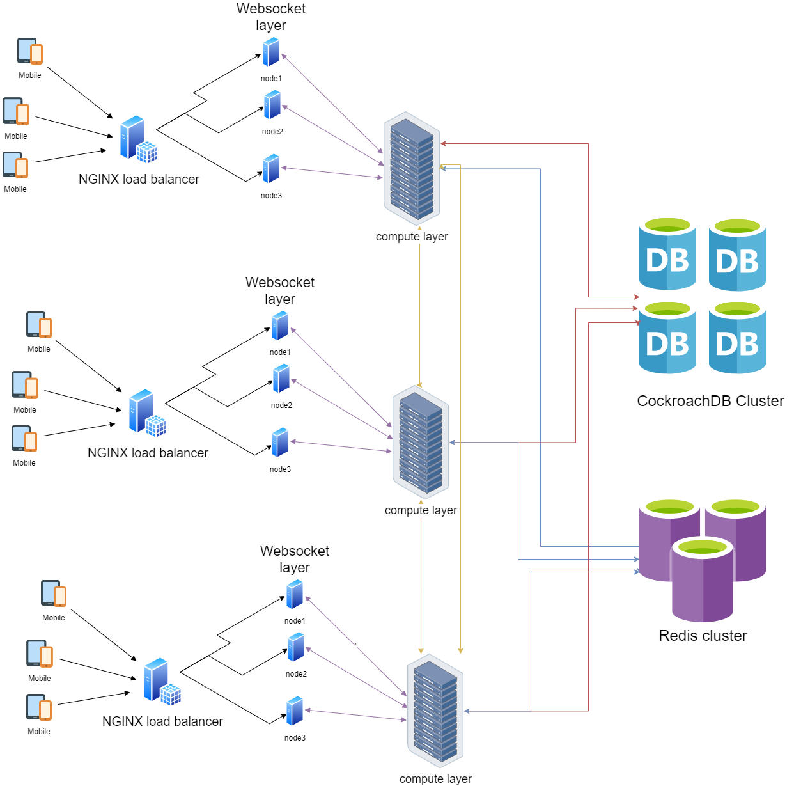

import { StaticImage } from "gatsby-plugin-image";
import { ProjectStatus } from "../../src/components/projects/ProjectStatus";

The inspiration behind Allchat was to bring the experience of Twitch chat to all live events. The fast paced, energetic, and absolutely ridiculous nature of Twitch chat is often the most entertaining part of watching a stream. The shared interest in the streamer is all that is required to form a unique community that people are excited to participate in. 

Allchat's goal was to allow these communities to form around any shared interest, not just a streamer. Channels would be created for live events such as:
- TV premiers
- Concerts
- Sporting events

Channels would also have the option of being location locked or unlocked, so that only people attending a live event could pariticipate.

I used Figma for UI/UX design.

I designed infrastructure with draw.io

