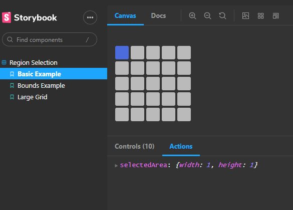

react-grid-select was created while building [Niftybillboard](/projects/niftybillboard) as a component to select a shape representing the aspect ratio of an image to display. It additionally needed to be able to have certain ranges disabled based on the space availability. This component took a significant amount of work to get right, so we decided to pull it into its own package and maintain it separately.

The demo below is from the [Storybook](https://hacksore.github.io/react-grid-select/?path=/story/region-selection--basic-example) which contains examples of all the ways the component can be used. 

Building this into a separate package made me think a lot about how to make a component highly customizable and scalable to different use cases. In the end the component can support fully customizable styles and grid sizes.

